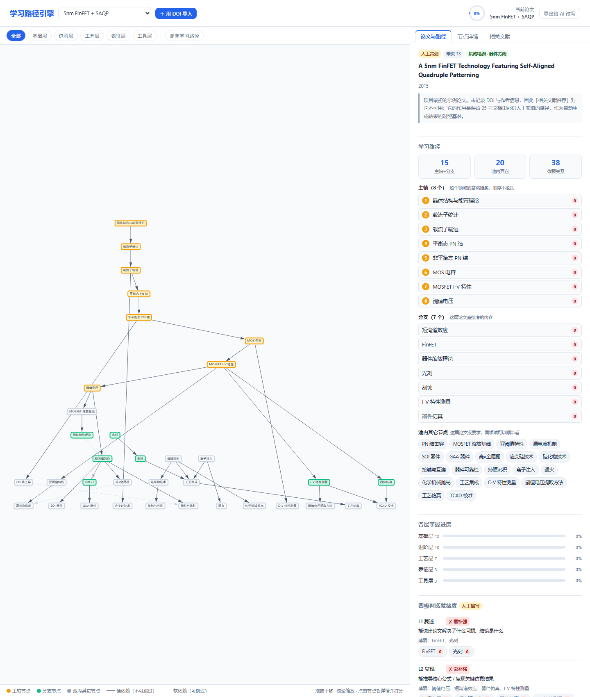

# 学习路径引擎

给一篇半导体论文的 DOI，它生成一条学习路径：读懂这篇论文该先学哪些知识点、按什么顺序、
每个知识点去哪找资料、还该读哪些相关文献。

在线试用：<https://mofan-mofan.github.io/learning-path-engine/app/>
（DOI 导入和相关文献两块要联网抓 Crossref / OpenAlex）

## 它在解决什么

读器件论文真正的卡点不是"这篇写了什么"，而是它默认你已经会了哪些东西：一句"利用场板
缓解漂移区电场峰值"，背后是衬底、外延、工艺、表征四层的十几个前置知识点，没人告诉你
缺哪几个、该按什么顺序补。引擎的做法是拿论文文本去匹配一张人工写的知识点依赖图，
倒推缺口的闭包，再按依赖边拓扑排序。图是死的，路径每次现算，所以换一篇论文不用重做数据。

现在装了两套节点池：IC 器件 35 个节点、宽禁带功率器件 25 个，共 90 条依赖边。每个节点
带 scope 字段，这就是"功率器件的论文不会被塞一条先学 FinFET 的路径"的机制。

## 自动与不自动

题录、领域判定、选节点、排序、五类相关文献推荐（同作者 / 同机构同方向 / 奠基文献 /
同主题高被引 / 引用本文的后续工作，每条带机器可核验的理由）都是自动的。不自动的是节点里
的知识内容，以及 Rubric 判据和练习任务的具体文字——那需要论文正文里的真实数字，公开接口
只给得到摘要，导入时只能出通用模板；要高质量版本点右上角「导出给 AI 改写」人工补。

## 最近更新

- 2026-09-12 · v2 重构：从单篇固定数据升级为填 DOI 自动生成路径，加了五类文献推荐和
  第二套节点池（power.wbg）。
- 设计文档 `03` 是现行 Schema v2.0；加节点之前先读 `04` 的粒度判据。

## 改东西的入口

所有可调参数在 `app/js/config.js`；加知识点改 `app/data/nodes-*.js`；改交互才碰
`app/js/app.js`。进 `app/` 之前先读 `app/README.md`：文件职责表、三条防误命中规则都在里面，
还记了实测过但明确不用的六种推荐信号——提改进需求前看一眼，别走回头路。

## 边界

摘要经常拿不到（Crossref 常缺，OpenAlex 的摘要由倒排索引还原，下标处空格会丢），拿不到时
界面会明说"自动路径质量会明显下降"。OpenAlex 作者消歧不准，所以"同作者"那类推荐必须配
主题过滤。它只负责把学习路径算清楚，不替你判断这篇论文值不值得读。

## License

MIT。
